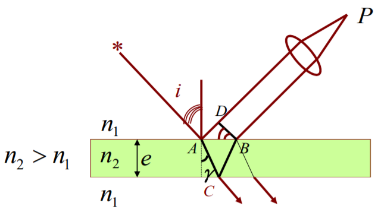

[TOC]

# 前言

此攻略由一直吃老本的Sora提供。由于他or她(?)一直吃老本，所以有些观念可能跟老师不一致，尽量以老师为准，此攻略也尽量贴合课本。

一些符号约定：  
1. 粗体表示向量。
2. 流数符号表示对时间的导数，如$\dot{x}$为$x$对时间的一阶导数，$\ddot{x}$为$x$对时间的二阶导数。

# 力学
> 基础，且与高中重复率高，只是有些概念需要更新。会尽量涉及所有定义。

## 质点运动学
**参考系**：通俗讲，参考系=尺子+表。描述质点运动前需要确定参考系。

**质点运动的描述**：位矢是时间的函数  
$$
\boldsymbol{r}=\boldsymbol{r}(t)
$$
定义位移为位矢的变化量。  
定义速度为位矢对时间的一阶导数
$$
\boldsymbol{v=\dot{r}}
$$
定义加速度为速度对时间的二阶导数
$$
\boldsymbol{a=\dot{v}}
$$
根据坐标系不同，这些量可以投影到各个方向。  
这三个量的微分关系很重要，下面列出一个常用的变换。设运动仅沿x方向，或投影到x方向。
$$
a=\frac{dv}{dt}=\frac{dv}{dx}\frac{dx}{dt}=v\frac{dv}{dx}
$$

**圆周运动**：  
圆周运动可由角度唯一确定，于是赋予角坐标特性。  
圆周运动的描述可写为：
$$
\begin{cases}
    r=r_0\\\theta=\theta(t)
\end{cases}
$$
我们约定角速度方向满足右手定则，赋予角速度矢量的性质。记作$\boldsymbol{\omega}$。  
规定角速度对时间的一阶导数为角加速度，$\boldsymbol{\beta=\dot{\omega}}$。
角量与线量的关系为：
$$
\boldsymbol{v=\omega\times r}
$$
给出一般圆周运动加速度表达式：
$$
\boldsymbol{a}=\boldsymbol{\omega\times(\omega\times r)+\beta\times r}
$$
当位矢与转轴垂直，可化为：
$$
\begin{cases}
    a_n&=-\omega^2r\\
    a_t&=\beta r
\end{cases}
$$

**相对运动**：  
实质上是坐标系的转换。设$S$相对$S^\prime$的位矢为$\boldsymbol{R}$，质点在$S$与$S^\prime$的位矢分别为$\boldsymbol{r}$与$\boldsymbol{r^\prime}$。于是有：
$$
\boldsymbol{r=r^\prime+R}
$$
对时间求导有：
$$
\boldsymbol{v=v^\prime+u}
$$
$$
\boldsymbol{a=a^\prime+a_s}
$$

## 质点动力学
~~牛顿三定律~~**牛顿第二定律**(又名牛顿方程)：
$$
\boldsymbol{F}=m\boldsymbol{a}
$$

**万有引力定律**：
$$
\boldsymbol{F_G}=-G\frac{m_1m_2}{r^2}\boldsymbol{e_r}
$$

**动能定理**：  
首先定义功，外力$\boldsymbol{F}$在极小段时间所做的元功为：
$$
dA=\boldsymbol{F}\cdot d\boldsymbol{r}
$$
总功即为力的路径积分：
$$
A=\int_l\boldsymbol{F}\cdot d\boldsymbol{r}
$$
顺手定义功率：
$$
P=\frac{dA}{dt}=\boldsymbol{F\cdot v}
$$
定义动能：
$$
E_k=\frac{1}{2}mv^2
$$
动能定理表达式为：
$$
A_合=\Delta E_k
$$

**功能原理与机械能守恒定律**：  
首先引入保守力概念：做功与路径无关的力称为保守力，运用粗浅的高数知识，即旋度为0的力称为保守力，即满足$\boldsymbol{\nabla\times F=0}$。  
运用此特性我们定义势能。人为规定势能0点O，定义P点的势能：
$$
E_p=-A_{OP}=-\int_l\boldsymbol{F}\cdot d\boldsymbol{r}
$$
列出常见势能：
$$
\begin{cases}
    E_p&=-G\frac{m_1m_2}{r}\\
    E_p&=mgh\\
    E_p&=\frac{1}{2}kx^2
\end{cases}
$$
定义机械能：系统某时刻的动能与势能之和。  
功能原理：
$$
A_外+A_{非保内}=\Delta E\tag{E为机械能}
$$
机械能守恒定律：  
若$A_外+A_{非保内}=0$，则机械能守恒。一般有如下两种表示方法。
$$
\begin{aligned}
    &E=Const\\
    &\frac{dE}{dt}=0
\end{aligned}
$$
下面一种经常用于代替牛顿方程列式。后面会讲。

**动量定理**：  
定义动量$\boldsymbol{p}=m\boldsymbol{v}$   
定义冲量$\boldsymbol{I}=\int_{t_0}^{t_1}\boldsymbol{F}dt$  
动量定理：
$$
\boldsymbol{I}=\Delta\boldsymbol{p}
$$

**动量守恒定律**：  
若系统不受外力或所受外力矢量和为0，则系统动量守恒。
$$
\sum m_i\boldsymbol{v}_i=Constvector
$$

## 刚体
> 仅讨论刚体的定轴转动。

类似圆周运动，刚体的定轴转动也可由角唯一确定，继承质点圆周运动使用的所有角量。

**转动定律**：  
定义力矩$\boldsymbol{M=r\times F}$  
定义刚体关于定轴的转动惯量
$$
J=\iiint_V r^2dm=\iiint_V r^2\rho dV
$$
转动定律：
$$
\boldsymbol{M}_合=J\boldsymbol{\beta}
$$

**关于转动惯量**：  
不加证明给出三个定理  
平行轴定理：过质心转轴和与之平行的转轴距离为d的转动惯量存在如下关系：
$$
J_o=J_c+md^2
$$
垂直轴定理：对于薄片，若正交三轴有两个轴a,b在薄片所在面，另一轴为z，有：
$$
J_z=J_a+J_b
$$
不知道叫什么：对正交三轴x,y,z以及其交点O，<u>此处r为到O的距离</u>，有：
$$
J_x+J_y+J_z=2\iiint_Vr^2dm
$$
不加证明给出几种常见体的转动惯量(括号注明求解最佳路径)  
均匀细杆，转轴垂直杆且通过质心：$J=\frac{1}{12}ml^2$  
均匀细杆，转轴垂直杆且通过杆一段：$J=\frac{1}{3}ml^2$(平行轴定理)  
均匀薄圆环or圆柱面，转轴垂直圆面且通过圆心：$J=mR^2$  
均匀圆盘or圆柱体，转轴垂直圆面且通过圆心；$J=\frac{1}{2}mR^2$  
均匀球壳，转轴过球心：$J=\frac{2}{3}mR^2$(不知道叫什么定理)  
均匀球体，转轴过球心：$J=\frac{2}{5}mR^2$(不知道叫什么定理)  

**类比质点**：
$$
\begin{aligned}
    E_k&=\frac{1}{2}J\omega^2\\
    A&=\int_{\theta_0}^{\theta_1}Md\theta
\end{aligned}
$$

**角动量定理**：
定义质点角动量，对参考点O有：
$$
\boldsymbol{L}=\boldsymbol{r\times p}=\boldsymbol{r}\times m\boldsymbol{v}
$$
对于质点系：
$$
\boldsymbol{L}=\sum \boldsymbol{L}_i
$$
对于刚体，相对转轴有(其实是相对于转轴上所有点都一样)：
$$
\boldsymbol{L}=J\boldsymbol{\omega}
$$
角动量定理：
$$
\int_{t_0}^{t_1}\boldsymbol{M}dt=\Delta\boldsymbol{L}
$$

**角动量守恒**：  
刚体所受合外力矩为0，则有：
$$
\boldsymbol{L}=Constvector
$$

# 电磁学  
> ~~那些高数下没学好的人有难了，我存在，就是要给他们带去噩梦~~

## 静电场

**库仑定律**：  
点电荷：
$$
\boldsymbol{F}=\frac{1}{4\pi\epsilon_0}\frac{q_1q_2}{r^2}\boldsymbol{e}_r
$$
带电体：
$$
\boldsymbol{F}=\iiint_V\frac{1}{4\pi\epsilon_0}\frac{q\rho}{r^3}\boldsymbol{r}dV
$$
电介质影响：  
替换$\epsilon_0\to\epsilon$，$\epsilon=\epsilon_r\epsilon_0$

**电场**：  
场的概念：数学上，运用粗浅的高数知识，标量场(数量场)与矢量场(向量场)可以这样定义：对于空间区域$G$内的任意点$M$，都有一个确定的标量or矢量，称空间区域$G$内确定了一个标量场or矢量场。
定义电场：单位电荷受到的电场力。  
点电荷产生的电场：
$$
\boldsymbol{E}=\frac{1}{4\pi\epsilon_0}\frac{q}{r^2}\boldsymbol{e}_r
$$
电场强度满足叠加定理，空间电场强度等于各带电体单独作用产生电场的叠加。  
故对于带电体有：
$$
\boldsymbol{E}=\iiint_V\frac{1}{4\pi\epsilon_0}\frac{\rho}{r^3}\boldsymbol{r}dV
$$

**高斯定理**：  
我一般记这个，将真空中和介质中的高斯公式统一起来：
$$
\oiint_S\epsilon_0\boldsymbol{E}\cdot d\boldsymbol{S}=\sum q_i
$$
亦可以写为体积分形式：
$$
\oiint_S\epsilon_0\boldsymbol{E}\cdot d\boldsymbol{S}=\iiint_V\rho dV
$$
运用条件及方法：
1. 高度对称。
2. 高斯面一般让电场线垂直穿过或和电场线平行。

**电势**：  
可证静电力为保守力，静电场为保守场。事实上静电场为有源无旋场。  
> 这个要说定义感觉有点懵了，课本上给的是单位电荷的静电能。算了，直接进计算。

点电荷的电势：
$$
U_p=\frac{q}{4\pi\epsilon_0r}
$$
电势满足简单叠加。带电体直接积分。
想知道某点电势也可以用：
$$
U_p=\int_a^\infty\boldsymbol{E}\cdot d\boldsymbol{r}
$$
或者运用粗浅的高数知识，电势其实是电场的势函数。 

若已知电势求电场可用$\boldsymbol{E}=-\nabla U$。

**导体的静电平衡**：
在静电平衡时，导体内部无电场。  
运用高斯定理可求得导体表面电荷分布：$\sigma=\epsilon_0E_n$

**电容器**：
定义式：
$$
C=\frac{q}{U_1-U_2}
$$

**电介质**：  
> 据我所知进入电介质很多人会开始迷惑。电介质也是静电场中最玄学的部分。

注意事项：  
1. 注意区别自由电荷、总电荷、极化电荷，求他们分别需要列不同的高斯定理。
2. 使用高斯定理求自由电荷的时候需要注意介电常数是否发生变化。
3. 一旦涉及到求总电荷，要注意约化用的电位移不能再搬到式子上。

高斯定理及对比：
$$
\oiint_S\epsilon_0\boldsymbol{E}\cdot d\boldsymbol{S}=\sum q_0\tag{总电荷}
$$
$$
\oiint_S \boldsymbol{D}\cdot d\boldsymbol{S}=\sum q\tag{自由电荷}
$$
$\boldsymbol{D}$为电位移矢量，$\boldsymbol{D}=\epsilon\boldsymbol{E}$

**静电能**：
> 这个之前有人问过我来着，好像是问静电能和电势能的关系，这个有点复杂，如果真的涉及到静电能推荐用能量密度做。

能量密度：(是标量但不满足简单线性叠加)
$$
w_e=\frac{1}{2}\boldsymbol{D\cdot E}
$$
静电能：
$$
W_e=\iiint_Vw_edV
$$

## 电流场
> 把这个东西放静磁场好像有点不好，单列吧

**电流**：  
电流强度：$I=\frac{dq}{dt}$，单位时间通过截面的电荷量。  
电流密度：$j=\frac{dI}{dS_\perp}$，单位时间通过单位面积的电荷量，并且规定方向与正电荷运动方向相同，故电流密度$\boldsymbol{j}$是矢量。  
电流面密度：$\sigma=\frac{dI}{dl_\perp}$
> 为方便区别这三个量且不至于混淆，我们可以称电流强度为电流线密度，电流密度为电流体密度，将三个量统一起来。

**传导电流与电场的关系**：
$$
\boldsymbol{j}=\sigma\boldsymbol{E}
$$
其中$\sigma$为导体的电导率，注意与电流面密度区别开。

**电动势**：
定义为电源中非静电力对单位电荷做的功，$\mathscr{E}=\frac{A}{q_0}$。  
辨析：
- 电动势就是电压($\times$)`电压在定义上与静电场静电力相关联，与电动势无关`
- 电动势是力($\times$)`这个量纲都不一样，我觉得会混淆的都是大佬，开局学的英语教材，这玩意英文是Electromotive Force`
- 电动势是非静电场($\times$)`同样的量纲就不对，只能说是一个静电场在空间上的作用效果`

## 磁场

引入磁感应强度$\boldsymbol{B}$来描述磁场。
> 磁场强度为$\boldsymbol{H}$，二者的关系为$\boldsymbol{B}=\mu_0\boldsymbol{H}$

**洛伦兹力**：
$$
\boldsymbol{F}=q\boldsymbol{v\times B}
$$

**磁场的高斯定理**：
$$
\oiint_S\boldsymbol{B}\cdot d\boldsymbol{S}=0
$$
亦即磁感应强度的散度为0，说明磁场的无源性。

**毕奥-萨伐尔定律**：  
对于一电流元有：
$$
d\boldsymbol{B}=\frac{\mu_0}{4\pi}\frac{Id\boldsymbol{l\times e_r}}{r^2}
$$
> 由于我们找不到电流元这种东西，所以单独分析两个电流元的相互作用力是不行的，因此结果不符合牛顿三定律也没什么奇怪的。

实际计算时我们总是要求回路产生的磁场，
$$
\boldsymbol{B}=\oint_l\frac{\mu_0}{4\pi}\frac{Id\boldsymbol{l\times e_r}}{r^2}
$$
> 课本上没有写闭合回路积分符号，个人觉得不好，因为电流总是要有回路才行。当你对两段电流而不是两个回路分析的时候，算相互作用力也会得到违反牛三的结果。

**安培环路定理**：  
$$
\oint_l\boldsymbol{B}\cdot d\boldsymbol{l}=\mu_0I=\mu_0\iint_S\boldsymbol{j}\cdot d\boldsymbol{S}
$$
亦即磁感应强度的旋度为$\mu_0\boldsymbol{j}$，说明磁场的有旋性。磁场非保守场，无法像静电场那样定义标量的磁势。`说明可以定义矢量的势（doge）`  
用安培环路定理求磁场所需要的的条件比高斯定理高很多，绝大多数时候还是使用毕奥-萨伐尔定律求磁场。

**安培定律**：
$$
\boldsymbol{F}=\int_lId\boldsymbol{l}\times\boldsymbol{B}
$$

**磁矩与磁力矩**：  
定义磁矩：$\boldsymbol{m}=I\boldsymbol{S}$，$\boldsymbol{S}$的方向与电流方向成右手螺旋。  
磁矩在均匀磁场不受力，受到的磁力矩为：$\boldsymbol{M=m\times B}$

磁介质：太难，大胆猜测不考。

## 电磁感应
> 实际上只有一个定理，内容很简单

**法拉第电磁感应定律**：
$$
\mathscr{E}=-k\frac{d\Phi_m}{dt}
$$
负号表示与磁通量的变化率成左手螺旋。

楞次定律：忘了它吧真的没用。

**动生电动势**：  
$$
\mathscr{E}=\int_l\boldsymbol{(v\times B)}\cdot d\boldsymbol{l}
$$

**感生电动势**：  
感生电场：
$$
\oint_L \boldsymbol{E_n}\cdot d\boldsymbol{l}=-\iint_S\frac{\partial\boldsymbol{B}}{\partial t}\cdot d\boldsymbol{S}
$$
> 无法唯一确定感生电场，由于解可以任意加减一个势场

感生电动势：
$$
\mathscr{E}=-\iint_S\frac{\partial\boldsymbol{B}}{\partial t}\cdot d\boldsymbol{S}
$$

**自感**：  
自感电动势：
$$
\mathscr{E}=-L\frac{di}{dt}
$$
自感计算公式：
$$
\Phi_L=LI
$$
计算时先假定电流$I$。  
自感磁能：
$$
W=\frac{1}{2}LI^2
$$

**互感**：  
假如元件1与元件2之间存在互感。约定符号系统：双下标，前一数字为目标，后一数字表示影响来源。  
有互感相等：$M_{12}=M_{21}$，故记为$M$。  
互感电动势：
$$
\begin{aligned}
    \mathscr{E}_{21}=-M\frac{di_1}{dt}\\\mathscr{E}_{12}=-M\frac{di_2}{dt}
\end{aligned}
$$
计算上类似自感。
$$
\begin{aligned}
    \Phi_1=MI_2\\\Phi_2=MI_1
\end{aligned}
$$

**磁场能量**：  
磁场能量密度：
$$
w=\frac{1}{2}\boldsymbol{B\cdot H}
$$

**麦克斯韦**：
> 先赌一手不考，就算考也只考小题。

位移电流：
$$
\boldsymbol{j}_d=\frac{\partial \boldsymbol{D}}{\partial t}
$$
电磁波传播速度：
$$
v=\frac{1}{\sqrt{\epsilon\mu}}
$$
麦克斯韦方程组：  
> 直接猜不考好吧

$$
\begin{aligned}
    \boldsymbol{\nabla\cdot D}&=\rho\\
    \boldsymbol{\nabla\times E}&=\frac{\partial\boldsymbol{B}}{\partial t}\\
    \boldsymbol{\nabla\cdot B}&=0\\
    \boldsymbol{\nabla\times H}&=\boldsymbol{j}+\frac{\partial\boldsymbol{D}}{\partial t}
\end{aligned}
$$

# 波动

## 简谐振动

**简谐振动方程**：  
$$
\frac{d^2x}{dt^2}+\omega^2x=0,(\omega>0)
$$
解为：
$$
x=A\cos(\omega t+\varphi)
$$
同时有速度：
$$
v=-A\omega\sin(\omega t+\varphi)
$$
和加速度：
$$
a=-A\omega^2\cos(\omega t+\varphi)
$$
**简谐运动的参数**：  
* $A$，振幅。
* $\omega$，角频率。
* $T=\cfrac{2\pi}{\omega}$，周期。
* $f=\cfrac{\omega}{2\pi}$，频率。
* $(\omega t+\varphi)$，相位。其中$\varphi$为初相位。相位可以任意加减$2\pi$的整数倍，一般取区间$-\pi$~$\pi$。

**旋转矢量与参考圆**：  
类似相量，不再赘述。

**简谐运动的能量**：  
$$
E=\frac{1}{2}m\omega^2A^2
$$

**同频率简谐运动的合成**：
$$
\begin{aligned}
    x_1=A_1\cos(\omega t+\varphi_1)\\
    x_2=A_2\cos(\omega t+\varphi_2)
\end{aligned}
$$
有
$$
x=x_1+x_2=A\cos(\omega t+\varphi)
$$
其中：
$$
\begin{cases}
    A=\sqrt{A_1^2+A_2^2+2A_1A_2\cos(\varphi_1-\varphi_2)}\\
    \varphi=\arctan(\cfrac{A_1\sin\varphi_1+A_2\sin\varphi_2}{A_1\cos\varphi_1+A_2\cos\varphi_2})
\end{cases}
$$

## 机械波

**波线、波面、波阵面**：
> 看图得了。P247

**各参数**：  
* $\lambda$，波长。
* $T$，周期。
* $\nu$，频率。
* $u$，波速。
* $k=\cfrac{2\pi}{\lambda}$，波数。
* $\omega=\cfrac{2\pi}{T}$，角频率。

联系直接记：$\lambda=uT$。

介质中的波速：
$$
\begin{aligned}
    u=\sqrt{\frac{G}{\rho}}\\
    u=\sqrt{\frac{E}{\rho}}\\
    u=\sqrt{\frac{K}{\rho}}
\end{aligned}
$$
其中$G,E,K$分别为切变、弹性、体积模量。

**平面简谐波**：  
表达式：
$$
y=A\cos(\omega t-kx+\varphi)
$$
其中$k=\cfrac{\omega}{u}$。若波沿x轴负方向传播，将$k$前的负号改成正号。

**平面简谐波的能量、能流**：  
> 也盲猜不怎么考

能量密度(单位体积内波的能量)：
$$
w=\rho(\frac{dy}{dt})^2
$$
平均能量密度：
$$
\bar{w}=\frac{1}{2}\rho A^2\omega^2
$$
能流密度(波的强度)：
$$
I=\frac{1}{2}\rho A^2\omega^2 u
$$
对于非平面的简谐波，只需将$A$换成此处的振幅即可。

**惠更斯原理与衍射**：  
惠更斯原理：对于某一时刻的波阵面，要确定下一时刻的波阵面，波阵面上每一点看做发射子波的波源，而下一时刻的波阵面即为这些子波的包络面。  
应用惠更斯菲涅尔原理可以计算得到衍射图样。

**波的干涉**：  
波的叠加：线性叠加，即为单独作用效果和。  
设两想干波振动表达式为：
$$
\begin{aligned}
    y_1=A_1\cos(\omega t-kr_1+\varphi_1)\\
    y_2=A_2\cos(\omega t-kr_2+\varphi_2)
\end{aligned}
$$
合振动为：$y=y_1+y_2$。  
有相位差为$2\pi$的整数倍，干涉加强，相位差为$\pi$的奇数倍，干涉相消。  
<u>非相干波观察不到干涉现象。</u>

**驻波**：  
$$
\begin{aligned}
    y_1=A_1\cos(\omega t-kx+\varphi_1)\\
    y_2=A_2\cos(\omega t+kx+\varphi_2)
\end{aligned}
$$
$$
y=y_1+y_2=2A\cos(kx+\frac{\varphi_1-\varphi_2}{2})\cos(\omega t+\frac{\varphi_1+\varphi_2}{2})
$$
量化结论：  
相位差$2\pi$整数倍的点振幅最大，为$2A$，称为波腹；相位差$\pi$奇数倍的点振幅最小，为$0$，称为波节。有相邻两波腹(波节)距离为$\frac{\lambda}{2}$。

**波的反射与半波损失**：  
波在不同介质的交界面处发生反射。定义波密介质与波疏介质：$\rho u$较大的为波密介质，较小的为波疏介质。  
波从波疏介质射向波疏介质，反射波相位有$\pi$的突变；反之没有。

**多普勒效应**：
> 这个真的好复杂，老师给的复习提纲上没有。那就是不考()

**声学**：
> 提纲上还是没有，那也是不考()

## 波动光学

首先引入光程：$L=nr$，$n$是折射率，$r$是在介质中的传播距离。  
若为同相相干光，光程差为$\lambda$整数倍时，干涉加强，为$\lambda/2$的奇数倍时，干涉减弱。

**杨氏双缝**：
  
光程差公式：
$$
\frac{\delta}{d}=\frac{x}{D}
$$
明纹中心：
$$
x=\pm k\frac{D}{d}\lambda
$$
暗纹中心：
$$
x=\pm(2k+1)\frac{D}{2d}\lambda
$$
条纹间距：
$$
\Delta x=\frac{D}{d}\lambda
$$

**薄膜干涉**：  

$$
\delta=2e\sqrt{n_2^2-n_1^2\sin i}+\frac{\lambda}{2}=2e\sin\gamma+\frac{\lambda}{2}
$$

**劈尖干涉**：  
劈尖为暗条纹。  
条纹间距为：
$$
\delta x=\frac{\lambda}{n\sin\theta}
$$

**牛顿环**：  
中央为暗环。  
暗环半径：
$$
r^2=kR\frac{\lambda}{n}
$$
亮环半径：
$$
r^2=(2k+1)R\frac{\lambda}{2n}
$$

**迈克耳孙干涉仪**：  
平面镜移动距离：
$$
d=N\frac{\lambda}{2}
$$
$N$为吞入条纹数。

**衍射**：  
菲涅耳衍射：光源和观察屏离衍射屏很近，近场衍射。  
夫琅禾费衍射：光源和观察屏离衍射屏无限远，远场衍射。

**夫琅禾费单缝衍射**：
> 光强分布：$I=I_0(\cfrac{sin\alpha}{\alpha})^2$  
> 其中$\alpha=\frac{1}{2}ka\sin\theta$，$a$为缝宽。

暗纹分布：
$$
a\sin\theta=k\lambda,k\neq 0
$$

**光栅衍射**：  
> 光强分布：$I=I_0(\cfrac{\sin N\gamma}{\sin\gamma})^2(\cfrac{\sin\alpha}{\alpha})^2$  
> 其中$\gamma=\frac{1}{2}kd\sin\theta$，$d$为光栅常数。$\alpha=\frac{1}{2}ka\sin\theta$，$a$为缝宽。

干涉主极大(光栅公式)：
$$
d\sin\theta=k\lambda
$$
由于衍射会造成缺级。此时有：
$$
k=k^\prime\frac{d}{a}
$$

**布拉格公式**：
> 提纲没有，略。

**偏振**：  
- 自然光经过偏振光强为原来的$\frac{1}{2}$。
- 马吕斯定律：$I=I_0\cos^2\alpha$。
- 布儒斯特定律：当入射角为$i=\arctan\cfrac{n_r}{n_i}$时，反射光为线偏振光，振动垂直入射面。

# 狭义相对论
> 符号约定：$u$为$S^\prime$系相对$S$系的速度，且沿x轴。  
> $\beta=\cfrac{u}{c}~,\gamma=\cfrac{1}{\sqrt{1-\beta^2}}$

**洛伦兹变换**：
$$
\begin{cases}
    x^\prime=\gamma(x-\beta ct)\\
    y^\prime=y\\
    z^\prime=z\\
    t^\prime=\gamma(t-\frac{\beta}{c}x)
\end{cases}~~~\begin{cases}
    x=\gamma(x^\prime+\beta ct^\prime)\\
    y=y^\prime\\
    z=z^\prime\\
    t=\gamma(t^\prime+\frac{\beta}{c}x^\prime)
\end{cases}
$$
变换式同时取微分，相除便可得到速度变换式。不再赘述。  
略去y与z坐标，洛伦兹变换亦可写成这样的形式。
$$
\begin{bmatrix}
    \Delta x^\prime\\c\Delta t^\prime
\end{bmatrix}=\begin{bmatrix}
    \gamma & -\beta\gamma\\
    -\beta\gamma & \gamma
\end{bmatrix}\begin{bmatrix}
    \Delta x\\c\Delta t
\end{bmatrix}
$$
容易看出变换矩阵非正交。  

**相对论动力学**：  
动质量：
$$
m=\frac{m_0}{\sqrt{1-v^2/c^2}}
$$
动量：
$$
\boldsymbol{P}=m\boldsymbol{v}
$$

**质能关系**：
$$
E=mc^2
$$

**能量与动量关系**：
$$
E^2=p^2c^2+m_0^2c^4
$$